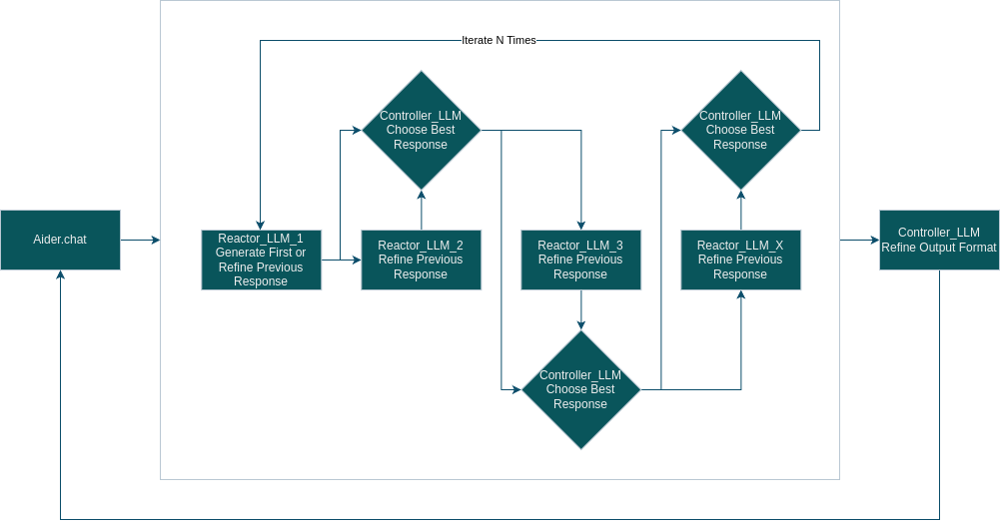

# ChainReactor

ChainReactor is a Python-based application designed as a wrapper for small local language models (LLMs). It primarily targets integration with [aider.chat](https://github.com/paul-gauthier/aider) and [OpenWebUI](https://github.com/open-webui/open-webui), providing an iterative processing and response refinement mechanism. The script can run as a command-line tool or as a Flask-based API server that implements a basic OpenAI API.

## Features

- **Iterative Processing:** Supports multiple iterations of LLM-based processing and refinement.
- **Response Comparison:** Compares the original and refined responses to choose the one that best matches the user's prompt.
- **Output Formatting:** Formats the final output in a specified structure when used with `aider.chat`.
- **API Server Mode:** Implements a basic OpenAI API for use with `aider.chat` and `OpenWebUI`.

## Workflow Diagram



The above diagram illustrates the workflow of the ChainReactor, from processing user prompts to refining responses and selecting the best output.

## Installation

### Prerequisites

- Python 3.12
- `pip` (Python package installer)

### Install Required Packages

```bash
pip install -r requirements.txt
```

Ensure you have the required dependencies installed. The `requirements.txt` file should contain the necessary Python packages, including `flask` and any dependencies related to `llama_index`.

## Usage

### Running as a Command-Line Tool

You can run the script directly from the command line for quick iterative LLM processing:

```bash
python chain_reactor.py --system-prompt "Your system prompt here" --user-prompt "Your user prompt here"
```

### Running with Aider.chat

To use ChainReactor with `aider.chat`, first run the script in server mode with aider-specific settings:

```bash
python chain_reactor.py --serve --aider
```

Then, create a file in your home directory named `.aider.model.metadata.json` with the following content:

```json
{
    "chain-reactor": {
        "max_tokens": 128000,
        "max_input_tokens": 128000,
        "max_output_tokens": 128000,
        "input_cost_per_token": 0,
        "output_cost_per_token": 0,
        "litellm_provider": "openai",
        "mode": "chat"
    }
}
```

After starting the server, set the necessary environment variables:

```bash
export OPENAI_API_BASE=http://127.0.0.1:5000/v1
export OPENAI_API_KEY=FAKE_KEY
```

Finally, start `aider.chat` with the following command:

```bash
aider --model openai/chain-reactor
```

In `aider.chat`, the `--aider` mode enables additional output formatting to increase the compatibility of the formatted output.

### Running with OpenWebUI

To use ChainReactor with [OpenWebUI](https://github.com/open-webui/open-webui), run the script in server mode without the `--aider` flag:

```bash
python chain_reactor.py --serve
```

Then, specify the API endpoint `http://127.0.0.1:5000/v1` in the OpenWebUI Admin Panel under **Settings > Connections**.

The `--aider` mode is not needed when using OpenWebUI, as it is specifically designed for `aider.chat` to ensure compatibility with its output formatting requirements.

## Configuration

ChainReactor allows you to customize its behavior by modifying the script directly. Below are key configuration options:

- **`reactor_llms`**: These are the LLMs that process the user prompt and perform iterative refinement. You can configure the models and their parameters.
- **`controller_llm`**: This LLM is responsible for picking the best response from the iterations and performing the final output formatting when used with `aider.chat`.
- **`iterations`**: Number of iterations to run the LLMs for refining responses.
- **`max_tokens`**: Maximum number of tokens allowed for the LLM responses.
- **`temperature`**: Sampling temperature for generating responses.
- **`aider_mode`**: Enables additional formatting when set for use with `aider.chat`.

Example configuration in the script:

```python
chain_reactor = ChainReactor(
    reactor_llms=[
        Ollama(model="mistral-nemo:12b-instruct-2407-q8_0", request_timeout=300.0),
        Ollama(model="codestral:22b-v0.1-q8_0", request_timeout=300.0),
    ],
    controller_llm=Ollama(model="phi3:14b-medium-128k-instruct-q8_0", request_timeout=300.0),
    iterations=2,
    max_tokens=128000,
    temperature=0.7,
    aider_mode=args.aider
)
```

You can adjust these parameters in the script to suit your specific needs.

## Contributing

Feel free to fork this repository and submit pull requests if you have suggestions or improvements.

## License

This project is licensed under the MIT License. See the [LICENSE](LICENSE) file for details.